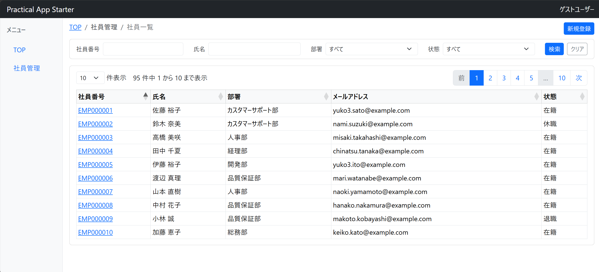
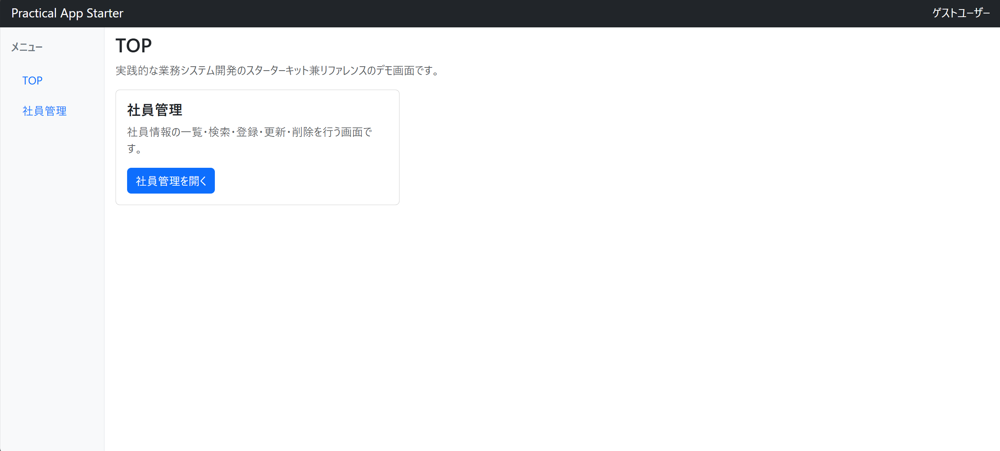
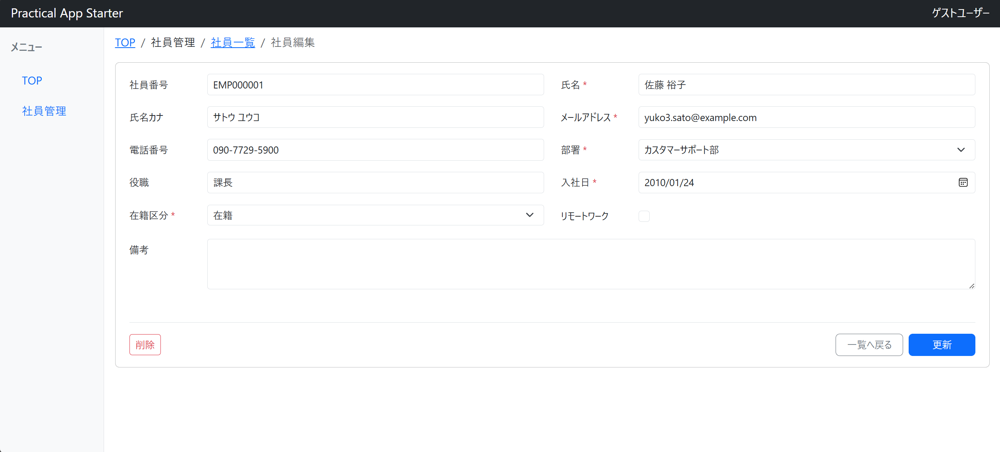

# Practical App Starter — Spring Boot Edition

業務システムのスターター兼リファレンス ― 開発ドキュメントを正本に、人と AI で役割分担して進める

## 概要

本プロジェクトは、業務システム開発のスターターキット兼リファレンスプロジェクトです。

開発ルールや設計書などの**開発ドキュメント**を正本（SSOT）とし、人とAIが同じ情報を参照しながら進めます。

AIには**設計・実装・レビュー**に加え、**作業管理、判断の整理・記録、ドキュメント整備**なども担ってもらいます。

**複数の専門的な役割を分担**することで、一人でも小規模チームに近い開発体制を目指すことをコンセプトにしています。

---

## 特徴

- **開発ドキュメント**：[`docs/`](docs/) 配下でソースと一体管理。初めての方は [`docs/README.md`](docs/README.md)（索引・読み方）から

- **AIとの役割分担ルール**：[`docs/02_rules/ai.md`](docs/02_rules/ai.md) に明文化（最終判断は人間が行う）

- **判断記録**：技術選定や設計変更の理由・却下案を [`docs/07_decisions`](docs/07_decisions/) に蓄積

- **再利用プロンプト**：代表例を [`prompts/`](prompts/) に公開

---

## 対象者

本プロジェクトは、以下のような方を対象としています。

- 業務システム（社内・受託向け CRUD 等）を一人〜少人数で開発している Java / Spring 開発者
- AI にコードは書かせられるが、設計・判断の前提がセッションをまたいで散らかってしまう方
- 開発ドキュメントを正本（SSOT）にして、人と AI が役割分担しながら進める型を知りたい方
- Spring Boot の実装例・業務システムの土台を探している方

**前提**：Javaの基本文法を理解していること。Spring Boot の基礎（Controller / Service / 画面遷移など）を一通り触ったことがあると望ましい。

---

## Version 1.0 の機能

社員管理はデモ題材です。業務システム開発でそのまま流用できる構成・設計・実装例を示すための土台として実装しています。

- 共通レイアウト
- TOP画面
- 社員管理（一覧・検索・登録・編集・削除）
- 入力チェック

その他の画面（TOP・社員編集）

---

## 動作環境・セットアップ

|項目|バージョン|
|---|---|
|Java|21|
|PostgreSQL|17|

ローカルで動かす手順は [`docs/01_project/setup.md`](docs/01_project/setup.md) を参照してください。

---

## 技術スタック

|分類|内容|
|---|---|
|言語|Java|
|フレームワーク|Spring Boot|
|テンプレートエンジン|Thymeleaf|
|CSSフレームワーク|Bootstrap|
|JavaScriptライブラリ|DataTables|
|SQLマッパー|MyBatis|
|データベース|PostgreSQL|

---

## リポジトリ構成

|フォルダ|内容|
|---|---|
|[`docs/`](docs/)|開発ドキュメント（索引は [`docs/README.md`](docs/README.md)）|
|[`src/`](src/)|アプリケーション|
|[`prompts/`](prompts/)|再利用プロンプト|
|[`.cursor/`](.cursor/)|Cursor 向け設定|

ディレクトリ構成の詳細は [`docs/02_rules/directory.md`](docs/02_rules/directory.md) を参照してください。

---

## 今後の予定

- CSV入出力
- Spring Security対応
- Docker対応
- AI協調開発プロセスの改善

詳細なロードマップは [`docs/01_project/project.md`](docs/01_project/project.md) §4 を参照してください。

---

## フィードバック

フィードバック・Issue を歓迎します。

---

## ライセンス

本プロジェクトは [Apache License 2.0](LICENSE) の下で公開しています。
