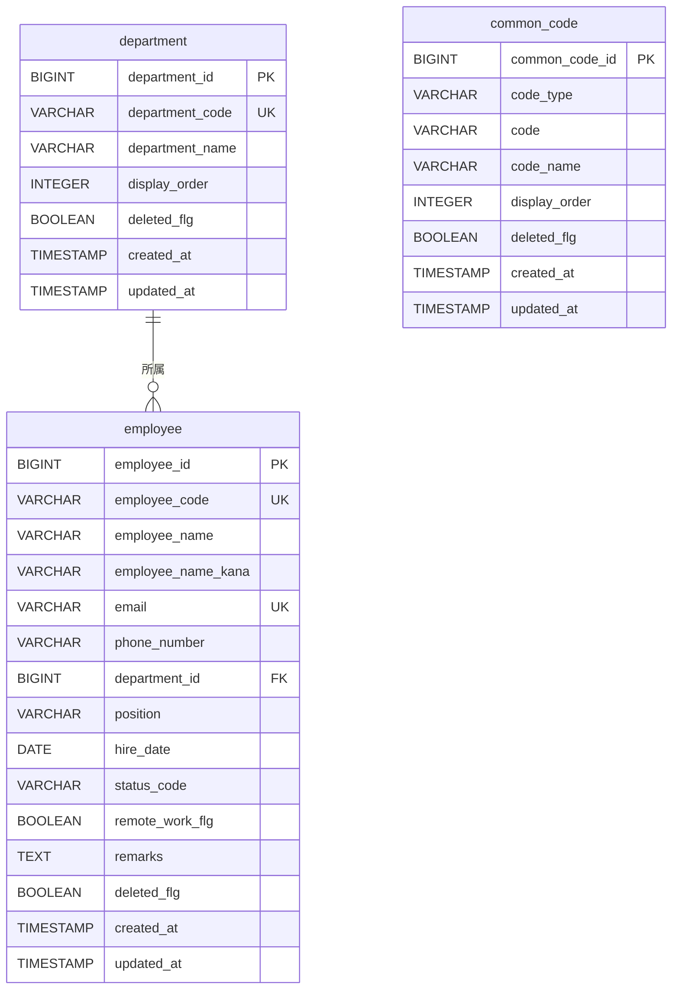

# ER図

**Document Version** : 1.0

**更新日** : 2026/07/30

本ドキュメントは、システム全体のテーブル構成と関連を示します。
命名・外部キー・区分コードなどのルールは [`docs/02_rules/db.md`](../02_rules/db.md) を参照してください。
テーブルの一覧は [`docs/03_system/tables.md`](tables.md) を参照してください。

---

## 1. 対象テーブル

現時点では、以下のテーブルを使用します。

- `common_code`
- `department`
- `employee`

---

## 2. ER図

---

## 3. 関連の補足

- `employee.department_id` は `department.department_id` を参照します。
- `employee.status_code` は `common_code` の `code_type = 'EMPLOYEE_STATUS'`、`code` を参照します。
- `status_code` は物理的な外部キー制約は設定しません。詳細は [`docs/02_rules/db.md`](../02_rules/db.md) §4 を参照してください。
